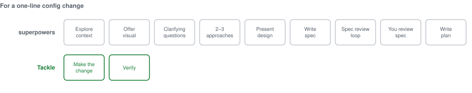

# Tackle

**All the discipline of superpowers, with none of the drill sergeant.**

Tackle is a skill framework for coding agents. It gives your agent the habits of a senior engineer: shaping designs, planning, test-first development, root-cause debugging, subagent delegation, code review, and refusing to say "done" without proof. What sets it apart is judgment. A typo gets fixed, a new subsystem gets a design, and Tackle can tell which is which.

Inspired by [obra/superpowers](https://github.com/obra/superpowers). Rebuilt to be lighter.



Superpowers' `brainstorming` skill opens with "You MUST create a task for each of these items and complete them in order", then lists nine, ending by handing off to `writing-plans`. It triggers on "creating features, building components, adding functionality, **or modifying behavior**". A config change modifies behaviour.

## At a glance

| | Superpowers 5.0.2 | Tackle |
|---|---|---|
| Words across its skills | ~15,600 | ~5,400 |
| Longest skill | 3,204 words | under 500 words, every skill |
| Injected into every session | ~760 words, claiming to override your system prompt | Nothing (Gemini: an 86-word note) |
| ALL-CAPS commands (MUST, NEVER, ALWAYS, REQUIRED, MANDATORY, ABSOLUTELY) | 43 | 0 |
| Process for a one-line config change | Design gate, spec, spec review loop, your review, then a plan | Make the change, then verify it |
| Wrote code before the test? | "Delete it. Start over." | Break the code on purpose, watch the test fail, keep your work |
| Review is done when | A reviewer agent says "approved" | Tests pass and every serious finding is verified |
| Needs git | Yes | No |
| Platforms | Claude Code, Codex, Gemini, Cursor, OpenCode | Claude Code, Codex, Gemini, from one skills folder |

Measured on superpowers 5.0.2's `skills/*/SKILL.md` and Tackle's `skills/*/SKILL.md`.

## The problem Tackle solves

Superpowers proved that packaged skills make coding agents dramatically more disciplined. It also proved you can overdo it:

- **Same ceremony for everything.** A config change and a new subsystem go through the same design, spec, review and plan gates.
- **Compliance by intimidation.** ALL-CAPS mandates, "1% chance" triggers and moral framing make agents over-trigger and leave them no room to judge when a rule doesn't fit.
- **Priority takeover.** A session-start hook injects instructions into every session that claim to override the harness's system prompt.
- **A fixed chain.** Each skill mandates the next, so you can't join partway through or skip a step.
- **Agent opinions as gates.** Review loops end when a reviewer says "approved", rather than when tests pass and findings are verified.
- **Git and branding assumptions.** Work gets committed to `docs/superpowers/…` paths, and the process breaks in non-git directories.

The result is an agent that spends your time and tokens on ritual. Tackle keeps every idea that makes superpowers good, and drops the ritual.

## What you get

- **An agent that sizes the job first.** Trivial, small or substantial, with the process scaled to match. No more brainstorming sessions about a typo.
- **Proof, not promises.** Every "done", "fixed" or "passing" is backed by a check run after the last change. Anything unverified is labelled as unverified.
- **Debugging that finds causes.** Reproduce, gather evidence, test one hypothesis at a time. Three failed fixes and it stops to question the design instead of flailing.
- **Reviews that mean something.** Tests and linters run first, reviewers must back findings with evidence, and "found nothing" is an acceptable answer.
- **Subagents with sense.** Routine tasks get a quick check, risky ones get a full review, and a subagent's report is never taken on faith.
- **You stay in charge.** Your instructions beat the harness, and the harness beats Tackle. Tackle never tries to outrank either.

## What the evals show

Tackle ships its own eval harness. Each case runs twice — once with Tackle loaded, once without — in a throwaway copy of a fixture repo, and the two arms are compared. The most recent run covered 2 cases, 5 runs per arm, 20 runs in total, on Claude Code with Sonnet 5.

| Case | Arm | Skill fired | Fix correct | Turns |
|---|---|---|---|---|
| Flaky test, cause not obvious *(skill should fire)* | with | 5/5 | 5/5 | 13.6 |
| | without | — | 5/5 | 10.8 |
| Missing dependency, error names the cause *(skill should stay quiet)* | with | 1/5 | 5/5 | 7.8 |
| | without | — | 5/5 | 7.0 |

Read honestly, that says:

- **Triggering works.** `debugging-systematically` fired on all five runs of the case that needed it.
- **Staying quiet mostly works.** It fired on one run in five of the case that didn't need it, and that run took 11 turns against 7 for the runs where it stayed out of the way.
- **It did not change the outcome.** Both arms produced a correct fix in all 20 runs. The check isn't a soft one: it reruns the suite 20 times and separately rejects the tempting wrong fix of simply waiting longer.
- **It costs turns.** Roughly three more on the case where it fires.
- **One behaviour did change.** Reproducing the failure before editing code: 2/5 with Tackle against 0/5 without. Still a minority of runs, and the honest read at this sample size is "a nudge", not "a fix".

So on these two cases Tackle buys a slightly more disciplined process for a small cost in turns, not a better answer. Two of the fourteen skills have automated cases so far; [evals/scenarios.md](evals/scenarios.md) lists the should-apply and should-not-apply scenarios for the rest.

Reproduce it with `node evals/run.mjs`. Results, transcripts and per-criterion verdicts land in `evals/results/<timestamp>/`.

## Principles

1. **Proportionate.** Size the work (trivial, small, substantial) and scale the process to match. Every skill says when to skip it.
2. **Reasoned, not shouted.** Skills explain why, in a calm voice, and trust the agent's judgment with explicit ways out.
3. **Never outranks you.** Your instructions and the harness come first. No session-start hook: skills load on demand from their descriptions.
4. **Composable, not chained.** Each skill can be used on its own and ends with *suggested* next steps.
5. **Evidence over approval.** Tests, types and linters are the gates. Reviewers report findings with severity and evidence, and serious findings are verified before anyone acts on them.
6. **Plans capture intent, not code.** Tasks carry intent, interfaces, a concrete check and risks. Code isn't written twice.
7. **Portable.** Git is optional, file locations follow your project's conventions, tools are described by role, and it has no shell hooks to break on Windows.
8. **Measured.** Each skill has scenarios where it should and shouldn't fire, and a runner that scores them against the same task without Tackle. A skill that doesn't earn its place is a skill to cut.

## Skills

Every skill follows the same template: a purpose paragraph, then **Scale it**, **How**, **Skip or shorten when**, **Done means**, and **Next**.

| Tackle skill | Purpose | Superpowers equivalent |
|---|---|---|
| `using-tackle` | Precedence, sizing the work, skill map | using-superpowers |
| `shaping-designs` | Turn an idea into an agreed design | brainstorming |
| `planning-work` | Tasks with intent, interfaces, checks and checkpoints | writing-plans |
| `executing-plans` | Work through a plan yourself, pausing at checkpoints | executing-plans |
| `delegating-to-subagents` | One subagent per task, with review matched to risk | subagent-driven-development |
| `investigating-in-parallel` | One agent per independent problem | dispatching-parallel-agents |
| `isolating-workspaces` | None, branch, worktree or copy, whichever is lightest | using-git-worktrees |
| `testing-first` | Red → green → refactor, and prove the test can fail | test-driven-development |
| `debugging-systematically` | Root cause before fix; rethink the approach after three failed fixes | systematic-debugging |
| `verifying-before-claiming` | Every claim backed by fresh evidence | verification-before-completion |
| `requesting-review` | Deterministic checks first, then an evidence-based review | requesting-code-review |
| `receiving-review` | Check feedback before acting on it; push back with evidence | receiving-code-review |
| `finishing-work` | Verify, summarise, integrate, clean up | finishing-a-development-branch |
| `writing-skills` | Template, budget, voice and evals for new skills | writing-skills |

## Platforms

The same `skills/` directory serves every platform. Skills describe tools by role, and [platforms.md](skills/using-tackle/references/platforms.md) maps each role to each platform's tools.

| | Claude Code | Codex | Gemini CLI |
|---|---|---|---|
| Packaging | Plugin (`.claude-plugin/`) | Native skill discovery (`~/.agents/skills`) | Extension (`gemini-extension.json`) |
| Session-start context | None | None | `GEMINI.md`, about 100 words |
| Subagents | Yes | Yes, on by default | Yes, on by default (`generalist`) |

If subagents are turned off or unavailable, the skills that use them fall back to a single session. Gemini CLI now serves only enterprise and paid-API users; others have moved to Antigravity CLI, which keeps skills and imports extensions as plugins (untested with Tackle; see [docs/gemini.md](docs/gemini.md)).

## Installation

### Claude Code

For local development:

```bash
claude --plugin-dir /path/to/tackle
```

Or register it as a local marketplace and install it:

```bash
/plugin marketplace add /path/to/tackle
/plugin install tackle@tackle-dev
```

### Codex

Link the skills into Codex's skill directory, then restart Codex:

```bash
mkdir -p ~/.agents/skills
ln -s /path/to/tackle/skills ~/.agents/skills/tackle
```

The Windows junction command, subagent setup, and troubleshooting are in [docs/codex.md](docs/codex.md).

### Gemini CLI

```bash
gemini extensions install <tackle-repo-url>
# or, from a local checkout:
gemini extensions link /path/to/tackle
```

Details are in [docs/gemini.md](docs/gemini.md).

### Other agents

Each skill is a plain `SKILL.md` with `name` and `description` frontmatter, so it works in any harness that supports agent skills. Copy or link `skills/` into that harness's skills directory.

### Running alongside superpowers

Both frameworks cover the same situations, so installing both gives the agent two competing sets of instructions, and superpowers loads its own rules at session start on every platform. Disable superpowers in projects where you use Tackle.

## Layout

```
.claude-plugin/          Claude Code plugin and marketplace manifests
gemini-extension.json    Gemini CLI extension manifest
GEMINI.md                Gemini CLI context note
skills/<name>/           SKILL.md plus any supporting prompts
skills/using-tackle/references/platforms.md   tool mapping per platform
docs/                    Codex and Gemini install guides, superpowers cross-reference
evals/run.mjs            with/without eval runner
evals/cases/<skill>/     prompt, fixture repo, automated check and grading criteria per case
evals/scenarios.md       should-apply and should-not-apply scenario for every skill
```

## Support

Questions, bugs and security concerns go to [GitHub Issues](https://github.com/MorganOnGitHub/tackle/issues).

If a skill fires when it shouldn't, or stays quiet when it should, that's a bug worth reporting — include the prompt you used and which agent you were running, and it becomes an eval case.

Tackle collects no data; see [PRIVACY.md](PRIVACY.md).

## Contributing a skill

Use the `writing-skills` skill. In short: start from a failure you've actually seen, describe *when* to use the skill (not what it does), follow the template, and stay under 500 words.

Then measure it. Add a row to [evals/scenarios.md](evals/scenarios.md) with a scenario where the skill should fire and one where it should stay quiet, and where you can, an automated case under `evals/cases/` so `node evals/run.mjs` scores it against the same task without Tackle. Make the case's check fail on the *tempting wrong fix*, not just on the original bug. A skill that doesn't beat the baseline is worth cutting.

## Acknowledgements

Tackle's skill coverage and many of its core ideas come from [superpowers](https://github.com/obra/superpowers) by Jesse Vincent (MIT licensed). Those ideas include evidence before claims, root-cause debugging, the implementer status codes, context isolation for subagents, and descriptions that state when to use a skill. Tackle is an independent rewrite, not a fork.
